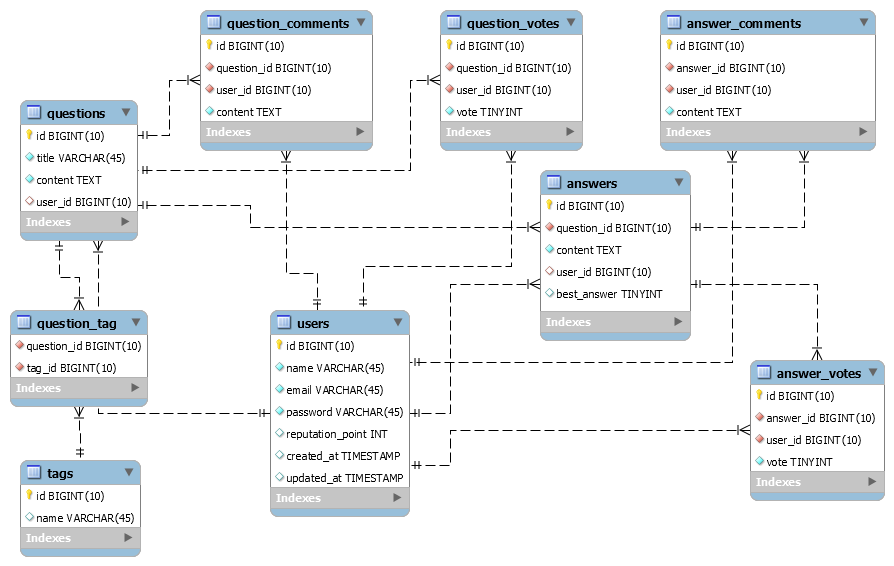

# Stackoverflow clone
> Final project from [Sanbercode](https://docs.google.com/document/d/1VlgnwIIYrK583Oj4BOL2nZUrj_2G6TuMVZzsmayHtr0/edit?usp=sharing).

### Demo URL
[https://larahub.herokuapp.com](https://larahub.herokuapp.com)

### Installation
1. Clone this repository
2. Run `composer install`
3. Setup your `.env` file
4. Generate IDE helper: `php artisan ide-helper:generate` (optional)
5. Happy coding! 👩‍💻👨‍💻💻

### ERD

Notes:
- Semua table menggunakan timestamps bawaan laravel kecuali table `question_tag`
- Table `users` mengikuti table bawaan dari laravel, kemudian ditambah column `reputation_point`
